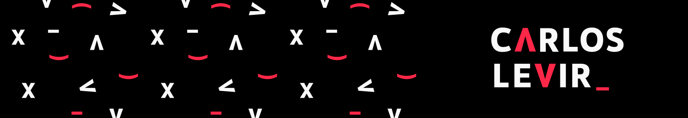
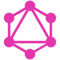

   

  <a href="https://instagram.com/c.levir">Instagram</a> •
  <a href="https://youtube.com/c/carloslevir">Youtube Channel (in portuguese)</a> •
  <a href="https://carloslevir.com">Blog</a>

---

## 👨🏻‍💻 A little bit about me

Hi there 👋🏻  
I'm Carlos Levir, Software Engineer at [Novatics](https://novatics.com), working over React.Js ecosystem.

My favourites tools:  <b>TypeScript</b>,  <b>React Js & React Native</b>,  <b>Node Js</b>

Currently learning:  <b>GraphQL</b>,  <b>Apollo</b>

